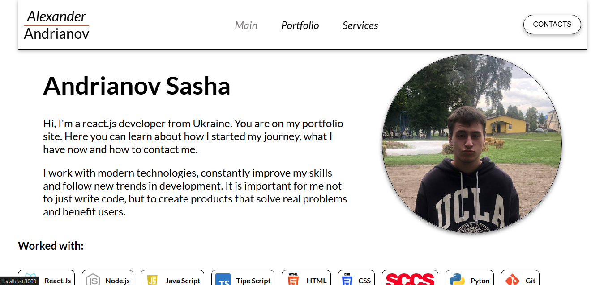

# 💼 Portfolio Website

## ⚛️ React Frontend Developer Portfolio

---

  

A modern personal portfolio website built with React to showcase projects, skills, and experience as a Frontend Developer.

---

## 🚀 About the Project

  

This portfolio is designed to present my work, highlight my skills, and provide a clean user experience with responsive design.

---

## 🧠 Tech Stack

  

- React  
- JavaScript (ES6+)  
- HTML5  
- CSS3 / SCSS  
- Responsive Design  

---

## ✨ Features

  

- modern UI design  
- responsive layout  
- projects showcase  
- skills section  
- contact form  

---

## 📬 Contact

- Email: Gn8282557@gmail.com 
- GitHub: https://www.fiverr.com/s/Gz7Nlaz
- Portfolio: https://my-portfolio-qqas.vercel.app/

---

⭐ If you like this project, feel free to star the repo!
